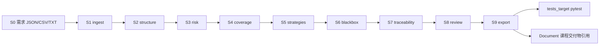

# AutoTestDesign 工具链 — 已实现功能与使用流程

> 与仓库根目录 [`README.md`](../README.md) 同步维护：**README 偏新手逐步操作**；**本文偏功能清单、使用流程总览与组内同步**。JSON 字段契约以 [`contracts/SCHEMA.md`](../contracts/SCHEMA.md) 为准。

---

## 1. 文档目的

- 列出当前仓库 **AutoTestDesign 工具侧已实现的全部能力**（对应课程 FR / 分工 P1～P4）。
- 给出 **所有推荐使用流程**（命令行、Web、分步脚本、审查、导出、自动化测试）。
- 说明与 **目标应用 `target-login-app`**、**`tests_target/`** 的关系。

**注意**：`Document/` 下风险报告、测试计划等描述的是 **被测登录演示站**，不是本工具源码本身。

---

## 2. 已实现功能总览

### 2.1 流水线步骤（S1～S9）

| 步骤 | 脚本 | 课程/分工 | 功能摘要 |
|------|------|-----------|----------|
| **S1** | `scripts/ingest.py` | FR 1.0 / P1 | 多源需求摄入：S0 JSON、CSV、纯文本、stdin；输出 `01_ingested.json` |
| **S2** | `scripts/structure.py` | FR 1.1 / P1 | 规则解析 `input_fields`、`data_ranges`、`conditions` 等；可选 `--use-ai` 与 LLM 并集融合 |
| **S3** | `scripts/risk_prioritize.py` | FR 2.0 / P2 | `risk_score`、`test_priority`、`risk_rationale`；可选 `--use-ai` 加权融合 |
| **S4** | `scripts/coverage_items.py` | P2 | 生成顶层 `coverage_items[]` |
| **S5** | `scripts/strategies_and_prompts.py` | FR 3.0 / P3 | 为覆盖项分配 EP / BVA / DT 及 `prompt_notes` |
| **S6** | `scripts/blackbox_generate.py` | FR 3.0 / P3 | 黑盒用例草稿 `test_cases[]` |
| **S7** | `scripts/traceability_and_analysis.py` | FR 6.0 / P4 | 追溯映射 `traceability`、结果 `analysis`、`improvement_records` |
| **S8** | `scripts/interactive_review.py` | P4 | CLI 交互修订用例/覆盖项；或 Web「审查」页保存 `08_reviewed.json` |
| **S9** | `scripts/export_artifacts.py` | FR 6.0 / P4 | 导出 `09_export_cases.json`；可选 CSV（cases + risk） |

### 2.2 集成与界面

| 组件 | 路径 | 功能 |
|------|------|------|
| **启动器** | `launcher.py` | 顺序调用 S1～S9；`--start-from`、`--input`、`--use-mock`、`--export-csv`、`--use-ai`、`--interactive-review` |
| **Web 前端** | `web_app/server.py` + `web_app/static/` | 需求导入（S1）、流水线（launcher）、产物浏览/下载、审查（S8）、说明；默认 **http://127.0.0.1:8765/** |
| **HTTP 服务** | `waitress`（默认） | 本地演示用 WSGI；`python web_app/server.py --dev` 可改用 Flask 内置服务器 |
| **目标应用测试** | `tests_target/` | pytest 消费 `09_export_cases.json` 测 `target-login-app` API |
| **契约与 Mock** | `contracts/SCHEMA.md`、`data/mock/` | 字段约定；`00`～`09` 样例供不接上游开发 |

### 2.3 需求输入（S0 / FR 1.0）

| 来源 | 路径或方式 | 说明 |
|------|------------|------|
| **默认（交作业推荐）** | `target-login-app/requirements/00_input_raw.json` | 8 条 `FR-TGT-*`，与目标应用行为人工对齐 |
| **CSV 演示** | `target-login-app/requirements/requirements.csv` | 与上述 JSON 同内容的表格形式 |
| **开发样例** | `data/mock/00_input_raw.json` | 3 条旧样例；`launcher --use-mock` 或 Web 勾选 mock |
| **自定义** | 任意 `.json` / `.csv` / `.txt` | `ingest.py --in` 或 Web「需求导入」上传/粘贴 |
| **stdin** | `ingest.py --in -` | 管道或键盘一整段（命令行） |

需求 **不是** 从目标应用自动抽取，而是人工编写或导入后走完整流水线（符合 FR 1.0 多源导入 + FR 1.1 解析）。

### 2.4 可选 LLM（不破坏默认行为）

| 项目 | 说明 |
|------|------|
| 模块 | `scripts/llm_optional.py`：读根目录 `.env`，OpenAI 兼容 Chat Completions |
| 生效步骤 | 仅 **S2、S3**（`--use-ai` 或 Web 勾选） |
| 配置 | 复制 `.env.example` → `.env`：`OPENAI_API_KEY` **或** `DEEPSEEK_API_KEY` + `DEEPSEEK_API_URL` + `MODEL` |
| 默认 | 未配置或未传 `--use-ai` 时，**纯规则**，与最初实现一致 |

### 2.5 依赖（`requirements.txt`）

`pytest`、`requests`、`Flask`、`waitress`、`openai`、`python-dotenv`（后两者为 LLM 可选）。

---

## 3. 数据流与产物目录

| 步骤 | 典型输出（`data/work/`） |
|------|-------------------------|
| S1 | `01_ingested.json` |
| S2 | `02_structured.json` |
| S3 | `03_with_risk.json` |
| S4 | `04_coverage_items.json` |
| S5 | `05_strategies.json` |
| S6 | `06_test_cases_draft.json` |
| S7 | `07_traceability.json` |
| S8 | `08_reviewed.json` |
| S9 | `09_export_cases.json`（+ 可选 `09_export_cases.csv`、`09_export_risk.csv`） |

- **`data/mock/`**：可提交 Git 的样例，供不接上游时单步调试。
- **`data/work/`**：本机运行结果，通常被 `.gitignore` 忽略。

---

## 4. 程序使用流程（全部场景）

下列流程可任选；**课堂演示推荐流程 B（Web）**。

### 4.0 总览图



---

### 流程 A：命令行一键全流程（最简单）

**适用**：交作业复现、CI、快速生成 `09`。

**前提**：仓库根目录；`pip install -r requirements.txt`（可选，launcher 子进程仅需 Python 标准库 + 各脚本依赖）。

| 序号 | 操作 |
|------|------|
| 1 | `cd` 到项目根目录 |
| 2 | `python launcher.py --export-csv` |
| 3 | 检查 `data/work/09_export_cases.json` 及 CSV |
| 4 | （可选）`python launcher.py --export-csv --use-ai`（需 `.env`） |
| 5 | （可选）`python launcher.py --use-mock` 仅用 mock 需求（非目标应用 8 条） |

**说明**：S1 默认读 `target-login-app/requirements/00_input_raw.json`；S8 默认 **透传**（非交互）。

**从中途调试**：

```powershell
python launcher.py --start-from structure --export-csv
```

（需已有对应上游 `data/work/*.json`。）

**交互式 CLI 审查**（仅终端）：

```powershell
python launcher.py --start-from traceability_and_analysis --interactive-review
```

**自定义 S1 输入**：

```powershell
python launcher.py --export-csv --input 你的需求.json
```

---

### 流程 B：Web 推荐流程（演示 / FR 1.0 展示）

**适用**：展示多源导入、审查、产物下载；避免重复跑 S1。

| 序号 | 页签 | 操作 |
|------|------|------|
| 1 | — | `pip install -r requirements.txt` |
| 2 | — | `python web_app/server.py`（可选 `--port 9000`） |
| 3 | — | 浏览器打开 **http://127.0.0.1:8765/** |
| 4 | **需求导入** | 选择来源 →「执行 S1」或「上传并执行 S1」→ 查看 `01` 摘要表 |
| 5 | **需求导入** | 点击「S1 完成后从 S2 跑流水线」（自动切页并设起点为 `structure`） |
| 6 | **流水线** | 确认起点为 `structure`（或 `ingest` 若未做第 4 步）→ 勾选需要的选项 →「启动流水线」→ 查看日志 |
| 7 | **产物浏览** | 刷新列表 → 查看 `09_export_cases.json` 等 → 下载 |
| 8 | **审查（S8）** | 加载 `work/07` → 修改用例/覆盖项/策略 →「保存为 08」 |
| 9 | **流水线** | 「仅运行 S9 导出」（需已有 `08_reviewed.json`） |

```mermaid
flowchart TD
  start[启动 web_app/server.py] --> ingest[需求导入: 执行 S1]
  ingest --> pipe[流水线: start_from=structure]
  pipe --> art[产物浏览: 查看 09]
  art --> rev{需要改字?}
  rev -->|是| s8[审查: 保存 08]
  s8 --> s9[流水线: 仅 S9]
  rev -->|否| end[完成]
  s9 --> end
```

**需求导入来源（单选）**：

| 选项 | 对应行为 |
|------|----------|
| 目标应用需求（JSON） | `target-login-app/requirements/00_input_raw.json` |
| 目标应用需求（CSV） | `target-login-app/requirements/requirements.csv` |
| 开发 mock 样例 | `data/mock/00_input_raw.json` |
| 粘贴纯文本 | 写入 `data/work/ingest_paste.txt` 后 ingest |
| 使用已上传文件 | 先前「上传并执行 S1」或 `web_upload_input.*` / `ingest_upload.*` |
| 上传并执行 S1 | 一步上传 `.json/.csv/.txt` 并 ingest |

**流水线页勾选项**：

| 勾选 | 作用 |
|------|------|
| S9 同时导出 CSV | `launcher --export-csv` |
| S1 改用上传文件 | `launcher --input data/work/web_upload_input.*`（若未在「需求导入」做过 S1） |
| S1 强制 mock | `launcher --use-mock` |
| S2/S3 启用 LLM | `launcher --use-ai` |

**注意**：Web **不能**运行交互式 CLI 版 S8；流水线内 S8 自动透传，改字请用「审查」页。

---

### 流程 C：Web 一键从 S1 跑到 S9

| 序号 | 操作 |
|------|------|
| 1 | 启动 Web（同流程 B 步骤 1～3） |
| 2 | **流水线** | 「从哪一步开始」选 `ingest`（或 `S1 ingest`） |
| 3 | 按需勾选 CSV / mock / LLM / 上传输入 |
| 4 | 「启动流水线」→ 等待日志结束（退出码 0） |

可与「需求导入」二选一：若已在「需求导入」执行 S1，请选 **`structure` 起跑**，避免 S1 重复执行。

---

### 流程 D：命令行分步脚本（调试单步）

**适用**：只改某一脚本、对接契约。

**通用形式**：

```powershell
python scripts/<脚本名>.py --in <输入.json> --out data/work/<输出.json>
```

**完整顺序（目标应用需求）**：

```powershell
python scripts/ingest.py --in target-login-app/requirements/00_input_raw.json --out data/work/01_ingested.json
python scripts/structure.py --in data/work/01_ingested.json --out data/work/02_structured.json
python scripts/risk_prioritize.py --in data/work/02_structured.json --out data/work/03_with_risk.json
python scripts/coverage_items.py --in data/work/03_with_risk.json --out data/work/04_coverage_items.json
python scripts/strategies_and_prompts.py --in data/work/04_coverage_items.json --out data/work/05_strategies.json
python scripts/blackbox_generate.py --in data/work/05_strategies.json --out data/work/06_test_cases_draft.json
python scripts/traceability_and_analysis.py --in data/work/06_test_cases_draft.json --out data/work/07_traceability.json
python scripts/interactive_review.py --in data/work/07_traceability.json --out data/work/08_reviewed.json
python scripts/export_artifacts.py --in data/work/08_reviewed.json --out data/work/09_export_cases.json --csv-dir data/work
```

**不接上游**：将 `--in` 改为 `data/mock/` 中上一阶段文件（见 SCHEMA）。

**S2/S3 加 AI**：

```powershell
python scripts/structure.py --in data/work/01_ingested.json --out data/work/02_structured.json --use-ai
python scripts/risk_prioritize.py --in data/work/02_structured.json --out data/work/03_with_risk.json --use-ai
```

---

### 流程 E：仅用 Mock 验收某一阶段（P1～P4 接力）

| 目标 | 示例命令 |
|------|----------|
| 只测 P2 S3 | `risk_prioritize.py --in data/mock/02_structured.json --out data/work/03_with_risk.json` |
| 只测 P2 S4 | `coverage_items.py --in data/mock/03_with_risk.json --out data/work/04_coverage_items.json` |
| 只测 P3 | 从 `data/mock/04` 跑 S5、S6 |
| 只测 P4 S7～S9 | 从 `data/mock/06` 或 `07` 起 |

---

### 流程 F：目标应用 + 自动化测试

| 序号 | 终端 | 命令 |
|------|------|------|
| 1 | 终端 1 | `cd target-login-app` → `python app.py` |
| 2 | 终端 2 | 项目根目录 `python -m pytest tests_target/ -v` |
| 3 | — | 测试读取 `data/work/09_export_cases.json`（可通过 pytest 选项改路径，见 `tests_target/conftest.py`） |

目标应用说明见 [`target-login-app/README.md`](../target-login-app/README.md)。

---

## 5. Web 前端功能明细

### 5.1 页签

| 页签 | 功能 |
|------|------|
| **需求导入** | 单独执行 S1；来源选择；粘贴/上传；`01` 摘要预览；跳转流水线 S2 |
| **流水线** | 异步 `launcher.py`；可选起点；CSV / mock / 上传 S1 / LLM；仅 S9 |
| **产物浏览** | 列出 `data/work` 下 json/csv/txt；查看内容；下载 |
| **审查（S8）** | 加载 07/08（或 mock）；编辑用例、覆盖项、策略 `prompt_notes`；保存 `work/08_reviewed.json` 并记 `improvement_records` |
| **说明** | 页内简要步骤 |

### 5.2 主要 HTTP API（供联调参考）

| 方法 | 路径 | 作用 |
|------|------|------|
| GET | `/api/ingest/options` | 可选来源与当前 `01` 摘要 |
| POST | `/api/ingest/run` | JSON 执行 S1（`source`: target / mock / paste / upload） |
| POST | `/api/ingest/run-file` | 上传文件并执行 S1 |
| POST | `/api/pipeline/run` | 启动 launcher 任务 |
| GET | `/api/pipeline/job/<id>` | 轮询流水线日志 |
| POST | `/api/export/run` | 仅 S9 |
| GET | `/api/artifacts/list` | 产物列表 |
| GET | `/api/artifact?name=` | 读取产物 |
| GET | `/api/download?name=` | 下载产物 |
| GET/POST | `/api/review/load`、`/api/review/save` | 审查加载/保存 |

### 5.3 启动参数

```powershell
python web_app/server.py              # 默认 127.0.0.1:8765，waitress
python web_app/server.py --port 9000
python web_app/server.py --dev        # Flask 开发服务器（会出现 production WARNING）
```

子进程与 `launcher` 已设置 `PYTHONUTF8=1`，Web 日志按 UTF-8/GBK 自动解码，避免中文乱码。

---

## 6. `launcher.py` 参数一览

| 参数 | 说明 |
|------|------|
| `--start-from STEP` | 从 `ingest`、`structure`、…、`export_artifacts` 或 `s1`～`s9` 开始 |
| `--input PATH` | 覆盖 S1 输入（仅当本 run 包含 ingest 步骤时） |
| `--use-mock` | S1 使用 `data/mock/00_input_raw.json` |
| `--export-csv` | S9 写出 CSV |
| `--use-ai` | S2、S3 附加 `--use-ai` |
| `--interactive-review` | S8 进入 CLI 菜单（覆盖默认透传） |
| （默认） | S8 `--pass-through` 透传 |

---

## 7. 推荐演示顺序（课堂/验收）

1. 打开 `contracts/SCHEMA.md` 说明接力契约。
2. **流程 B（Web）**：需求导入 → 流水线 S2～S9 → 产物看 `09`。
3. **审查**：改一条用例 → 保存 `08` →「仅 S9」→ 对比 `09` 变化。
4. **流程 F**：启动 `target-login-app`，跑 `pytest tests_target/`。
5. （可选）展示 **流程 A** 与 **`--use-ai`**（需 `.env`）。

---

## 8. 常见问题

| 现象 | 处理 |
|------|------|
| Web 日志中文乱码 | 重启 `web_app/server.py`（已修复编码）；浏览器 Ctrl+F5 |
| 流水线失败 | 看日志；缺 `01` 时先做「需求导入」或从 `ingest` 起跑 |
| `launcher` 找不到 `scripts` | 在**仓库根目录**执行 |
| pytest 大量 skip | 未启动 `target-login-app` 时 API 测试 skip 属正常 |
| Flask `production` WARNING | 默认已用 waitress；勿用 `--dev` 除非调试 |
| 勿提交 `.env` | 密钥仅放本机 `.env` |

---

## 9. 相关文件索引

| 文件 | 用途 |
|------|------|
| [`README.md`](../README.md) | 新手逐步命令、目录说明、FAQ |
| [`contracts/SCHEMA.md`](../contracts/SCHEMA.md) | JSON 字段 S0～S9 |
| [`.env.example`](../.env.example) | LLM 环境变量模板 |
| [`launcher.py`](../launcher.py) | 流水线入口 |
| [`web_app/server.py`](../web_app/server.py) | Web 服务 |
| [`Document/详细分工方案.txt`](详细分工方案.txt) | 四人分工 |

---

*本文档随工具迭代更新；若与 SCHEMA 冲突，以 SCHEMA 为准。*
